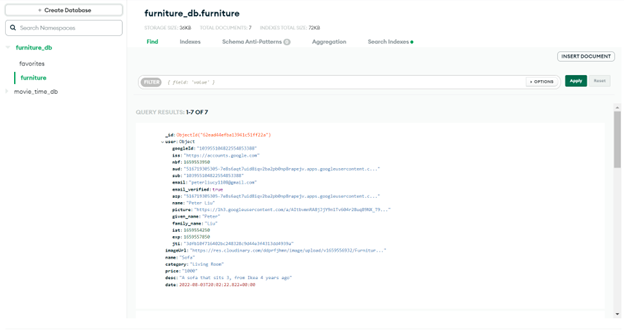
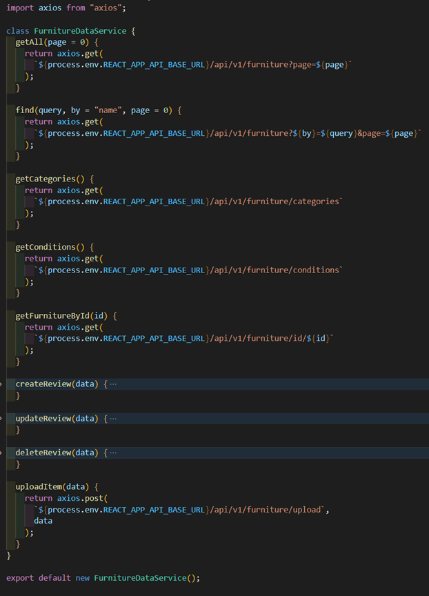

<h1>Project Information</h1>

Team name: Peter in Raincouver

Team members: Peter, Yingyu (Rain)

Project idea: Once Upon A Furniture. An online platform for used furniture buy and sell.

Source of starter code: Rain's Movie Time Project in CS5610, Summer 2022

# Furniture-backend

<h1>Iteration 1</h>

<h2>Peter</h2>

Create new listing page backend:
The following is the mongodb which store each item, it includes the user info who uploaded it, as well as the information of each item that is typed by the user from the create new item page. In mongodb it stores the whole google user information.

As for the backend routing API, the following API is mainly used for:
1. getting the furniture (getAll function)
2. finding it by query type (find function)
3. getting individual furnitureId details (getFurnitureId function)
4. upload the items (uploadItem function)
5. get all the available categories sand conditions from the uploaded items (getCategory, getCondition function)
Axios is used as a library for backend.

<h2>Rain</h2>
1. Created the GitHub repositories and provided the starter code for this project.

2. Worked on the homepage: modified the starter code and linked to the the new furniture database.
 - Each listing shows its product name, price, description and a link to the product detail page.
 - It provides search by name, search by category (living room, dinning room, bedroom, etc), and search by used condition functionalities.
 - The navigation bar provides links to the homepage, my account page and a selling page.

3. Worked on the product page: this page shows the product photo, product information and the seller information

4. Worked on the My Account page. This page contains the user's information, wishlist, and listing history (placeholder).

5. Adapted the codes from the starter code to this new project, combined the redundant DAOs and controllers to make codes more concise.

Note: screenshots for the pages are shown in the README of the frontend repository
